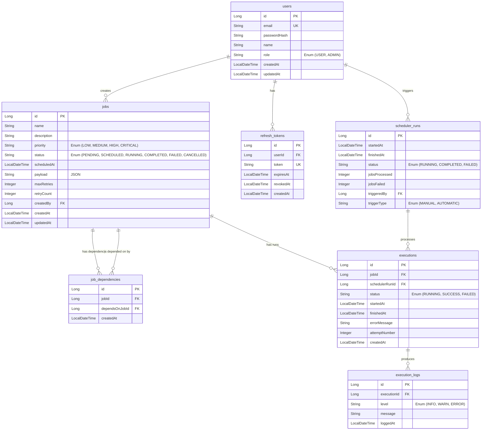

# ER Diagram — Priority-Based Task Scheduler

Типовете са написани в Java/JPA стил (Long, String, LocalDateTime, Enum), така че схемата е неутрална спрямо избора на база данни (MySQL / PostgreSQL).

## Entities

### users
Потребители на системата. Свързани с jobs (кой кой job е създал) и с refresh_tokens (за JWT auth).

### jobs
Основната единица — задача за изпълнение. Има приоритет, статус, scheduledAt време, payload (JSON параметри), retry логика.

### job_dependencies
Self-referencing many-to-many между jobs — показва кой job от кой зависи. Използва се за detect circular dependencies и dependency resolution при scheduler execution.

### scheduler_runs
Всяко стартиране на scheduler-а (ръчно през POST /scheduler/run или автоматично по график). Тракне старт, край, статус, брой обработени jobs. Всяко `execution` принадлежи на конкретен `scheduler_run`.

### executions
История на всяко изпълнение (или опит за изпълнение) на даден job. Свързва се с retry logic и Execution History screen. Всяко execution принадлежи на `scheduler_runs`.

### execution_logs
Детайлни log редове за всяко изпълнение (stdout/stderr, level, timestamp). Използва се в Job Details и Execution History екраните.

### refresh_tokens
JWT refresh tokens — за да може Login Page-а да прави long-lived sessions с възможност за revocation.

---

## Mermaid ER Diagram

---

## Enum Values

| Enum | Values |
| :--- | :--- |
| `Role` | USER, ADMIN |
| `Priority` | LOW, MEDIUM, HIGH, CRITICAL |
| `JobStatus` | PENDING, SCHEDULED, RUNNING, COMPLETED, FAILED, CANCELLED |
| `ExecutionStatus` | RUNNING, SUCCESS, FAILED |
| `SchedulerRunStatus` | RUNNING, COMPLETED, FAILED |
| `TriggerType` | MANUAL, AUTOMATIC |
| `LogLevel` | INFO, WARN, ERROR |

## Relationships Summary

- `users (1) → (N) jobs` — всеки потребител може да създава много jobs
- `users (1) → (N) refresh_tokens` — потребител може да има много активни refresh tokens
- `users (1) → (N) scheduler_runs` — потребител може да е стартирал много scheduler run-ове
- `jobs (1) → (N) job_dependencies` — един job може да има много зависимости
- `jobs (1) → (N) job_dependencies` (като target) — един job може да е зависимост на много други
- `jobs (1) → (N) executions` — един job има история от опити за изпълнение
- `scheduler_runs (1) → (N) executions` — един scheduler run обработва много jobs
- `executions (1) → (N) execution_logs` — едно изпълнение произвежда много log редове

## Indexes (препоръки)

- `users.email` — UNIQUE
- `jobs.status` — за бързи филтри в Dashboard и Failed Jobs
- `jobs.scheduledAt` — за scheduler-а да намира готовите jobs
- `jobs.priority` — за сортиране при изпълнение
- `job_dependencies (jobId, dependsOnJobId)` — UNIQUE composite
- `executions.jobId` — за бързо извличане на история
- `executions.schedulerRunId` — за групиране по scheduler run
- `execution_logs.executionId` — за бързо извличане на логове
- `refresh_tokens.token` — UNIQUE
- `refresh_tokens.userId` — за bulk revoke
- `scheduler_runs.startedAt` — за chronological листване
